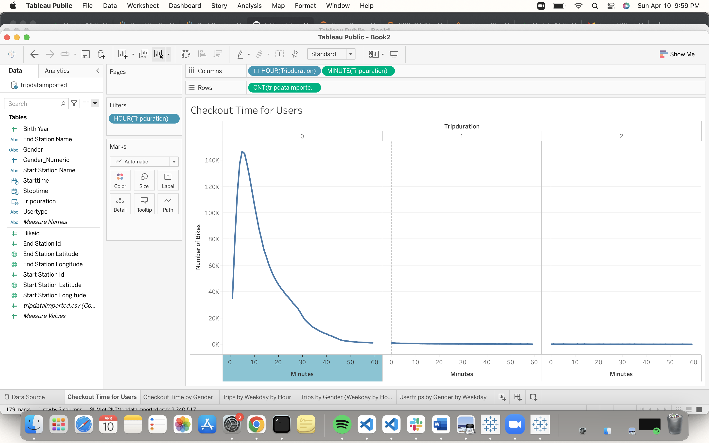
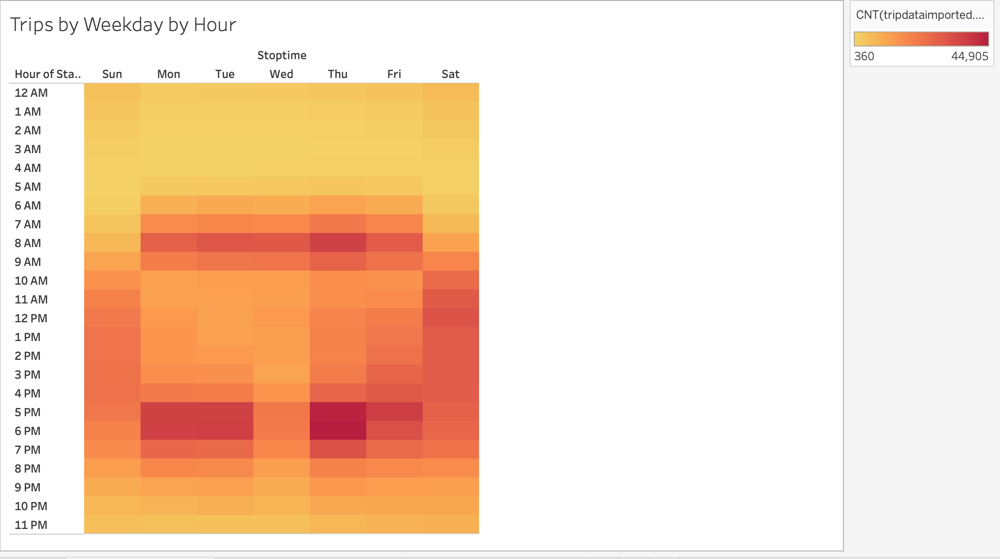
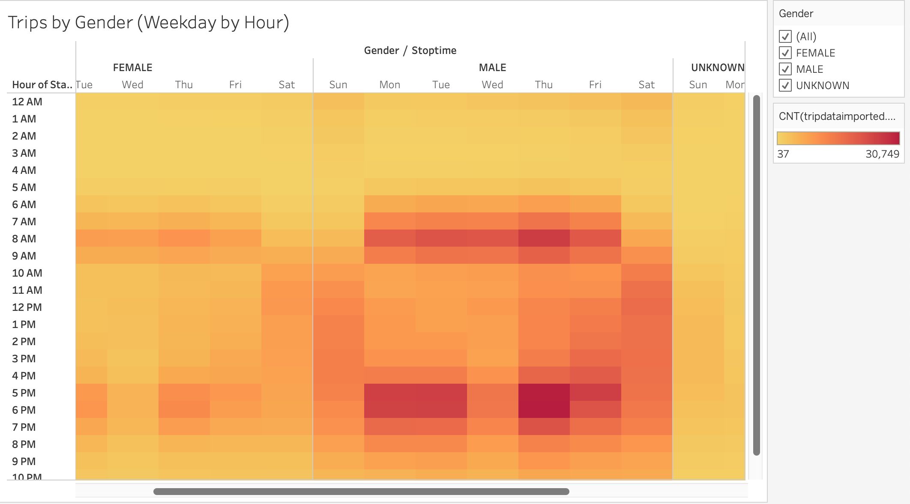
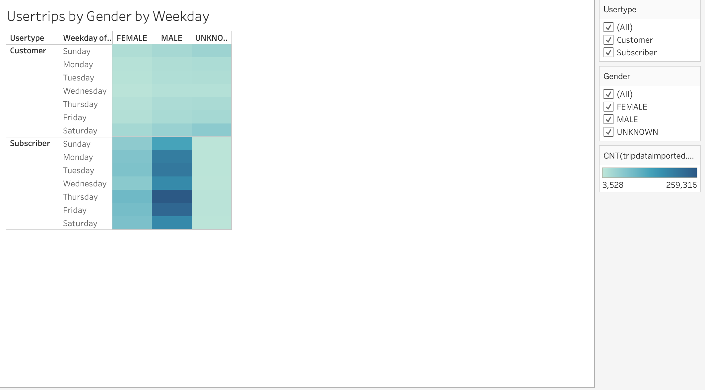

# bikesharing

## Overview
This analysis was to look at the NYC bike data and analyse by different categories. Checkout times by users and genders, trips by weekday and hour and trips by gender. In the results, we put together 5 different graphs using Tableau.
## Results
We created a tableau story to show our analysis of NYC bikes data. See the link below:

[link to dashboard](https://public.tableau.com/app/profile/brittany.marchand/viz/NYCCityBikeAnalysis_16510124384060/NYCCityBikes?publish=yes)

From this graph we can see that most people checkout their bikes for 20 minutes or less. We can also see that the max amount of bikes being checked out is between 147000 bikes.

From this graph we can see there is a large difference between males and females who are checking out bikes. They both seem to checkout their bikes for similar amount of time, but there are way more males taking bike rides.

From this graph we can see that most people are bringing back their bikes in the evening, and especially there are way more people taking bike rides near the end of the week. There is also more people taking rides in the morning around 8 am as well. It seems around 8 am and 5-6 pm are the most popular times.

This graph is similar to the last, but again it shows the large difference of males riding compared to women.

Our final graph shows that most people in the city that are riding bikes are subscribers vs. one time customers. It also shows that Thursday seems to be the most people day and again, that males are riding more often than females.

## Summary 

In summary, we can see a lot of different trends around bikes in NYC from our data analysis. Males seem to ride bikes more, most people only take a ride for 20 min or less, and the highest amount of bike rides are found in the mornings or evenings (around the work schedule) and especially more rides near the end of the week.

