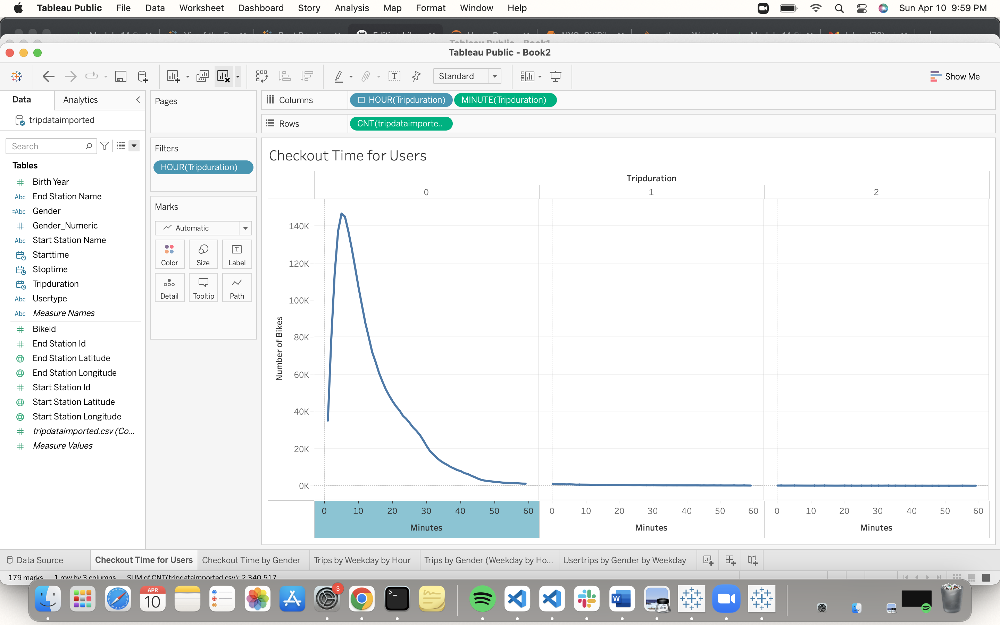
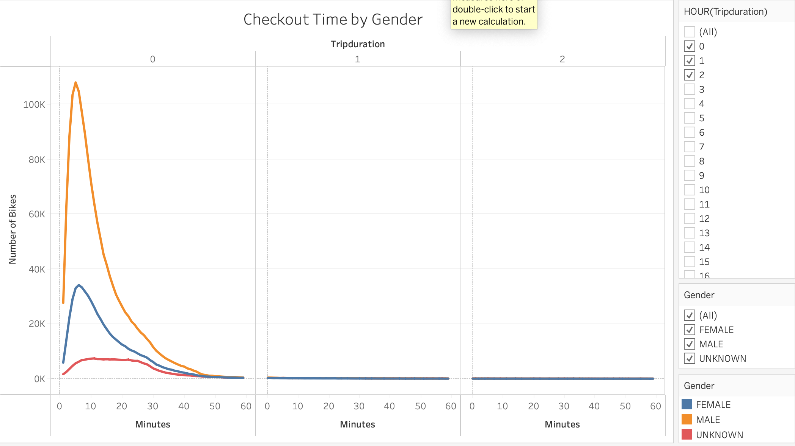
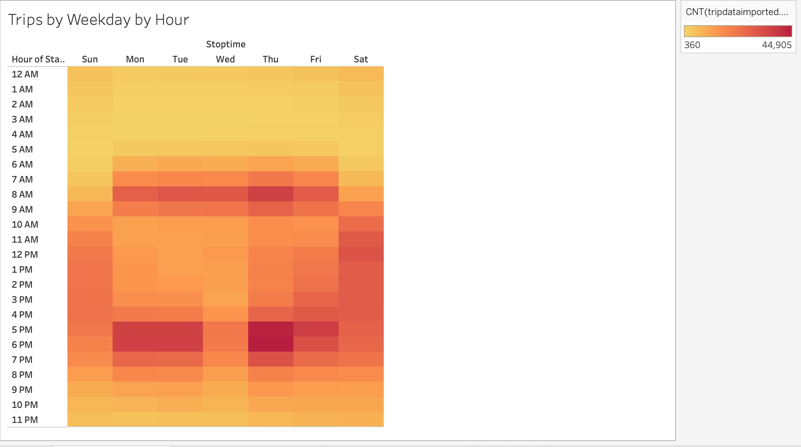
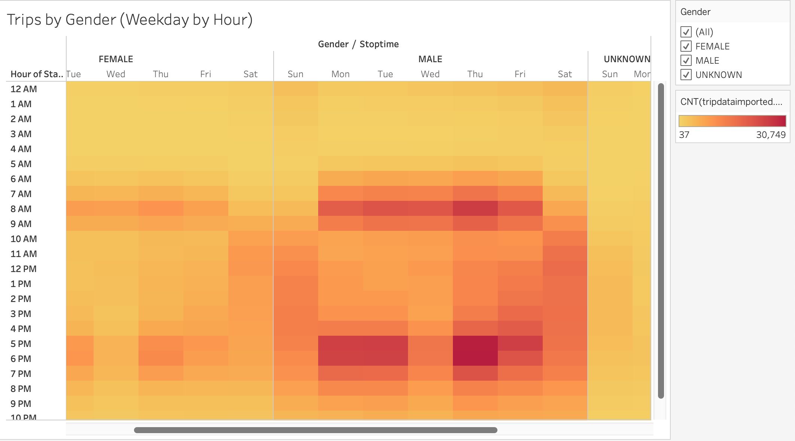
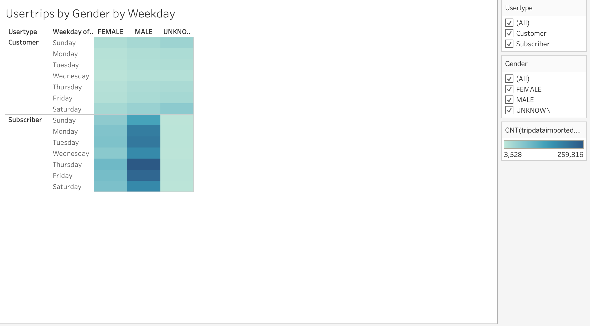

# bikesharing

## Overview
This analysis was to look at the NYC bike data and analyse by different categories. Checkout times by users and genders, trips by weekday and hour and trips by gender. In the results, we put together 5 different graphs using Tableau.
## Results

## Summary 

